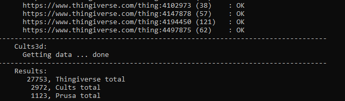
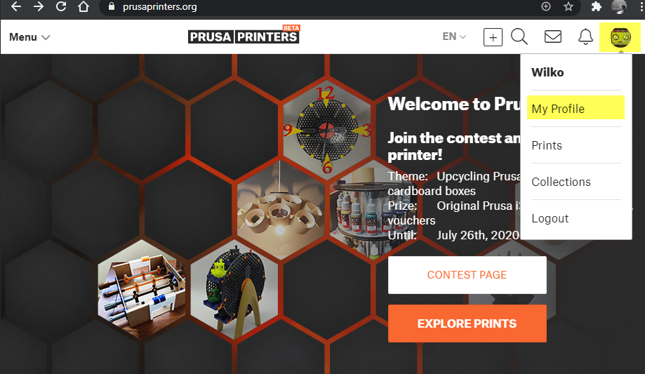
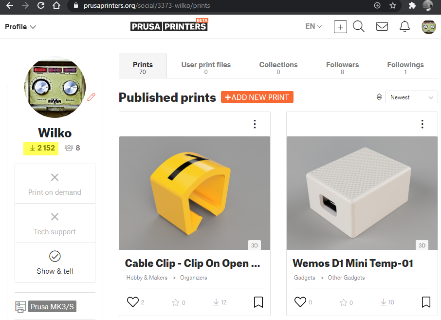

# 3dPrintingSitesStatistics

Get download statistics from thingiverse, cults3d and prusa

## Installation

### Clone repository From github

1. Navigate to your scripts directory (e.g. /mnt/d/Scripts)
2. git.exe clone --progress -v "https://github.com/WilkoV/Tools_3dPrintingSitesStatistics.git" "YOUR_SCRIPT_DIRECTORY\3dPrintingSitesStatistics"

### Download Archive From github

1. Download [latest release](https://github.com/WilkoV/Tools_3dPrintingSitesStatistics/releases)
2. Copy and unpack the downloaded archive in your script directory (e.g. /mnt/d/Scripts)

## Configuration

### Configure config/3dStatistics.ini

1. Navigate to the 3dPrintingSitesStatistics directory (e.g. /mnt/d/Scripts/3dPrintingSitesStatistics)
2. Make script executable (chmod +x 3dPrintingSitesStatistics)
3. Start script to create configuration templates (./3dPrintingSitesStatistics)
4. Create your Thingiverse app token by creating a [web app](https://www.thingiverse.com/apps/create)
5. Navigate to your configuration directory (e.g. /mnt/d/Scripts/3dPrintingSitesStatistics/config)
6. Edit 3dStatistics.ini and initialize the variable thingApiToken with your app token

### Configure config/thingiverse.items

1. Ensure that [Configure config/3dStatistics.ini](#Configure-config/3dStatistics.ini) is already executed
2. Edit thingiverse.items and remove example entries and place your own links

## Execute script

1. Navigate to the 3dPrintingSitesStatistics directory (e.g. /mnt/d/Scripts/3dPrintingSitesStatistics)
2. Start script ./3dPrintingSitesStatistics
3. Script will ask for the number of downloads for the PrusaPrinter site. The data can be found on the [here](Get-Number-Of-Downloads-From-PrusaPrinters)
4. The script will get the data from Thingiverse and Cults3d. Depending on the stability of the Thingiverse site and the number of things configured in config/thingiverse.items this can take several minutes.
5. As a final step, the script shows a summary

### Get Number Of Downloads From PrusaPrinters

Open [PrusaPrinters](https://www.prusaprinters.org/), click on your avatar in the top/right corner and click on "My Profile"

The number of total downloads is printed below the profile image

## Visualize Data

[This](https://docs.google.com/spreadsheets/d/1G0BuWeprStKeENTARQpzT7mMXFmpkBT05Sm_zNOfY4M/edit?usp=sharing) is an example google sheet that can be used to visualize the data. Copy the sheet to your goolge account and remove example data from the tab named "Source" and past the data from results/statistics.csv into the sheet. Remember to chose the "Split text to columns option".

